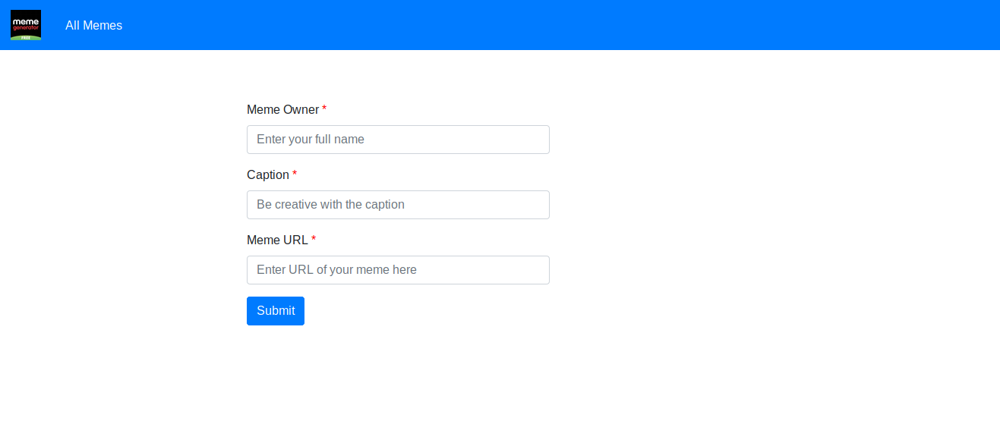

[![Contributors][contributors-shield]][contributors-url]
[![Forks][forks-shield]][forks-url]
[![Stargazers][stars-shield]][stars-url]
[![Issues][issues-shield]][issues-url]
[![MIT License][license-shield]][license-url]
[![LinkedIn][linkedin-shield]][linkedin-url]

<!-- PROJECT LOGO -->
<br />
<p align="center">
  <a href="https://github.com/github_username/repo_name">
    
  </a>

  <h3 align="center">Xmeme</h3>

  <p align="center">
    A Meme Stream Page.
    <br />
    <a href="https://github.com/sumit-03/Xmeme"><strong>Explore the docs »</strong></a>
    <br />
    <br />
    <a href="https://github.com/sumit-03/Xmeme">View Demo</a>
    ·
    <a href="https://github.com/sumit-03/Xmeme/issues">Report Bug</a>
    ·
    <a href="https://github.com/sumit-03/Xmeme/issues">Request Feature</a>
  </p>
</p>


<!-- TABLE OF CONTENTS -->
<details open="open">
  <summary><h2 style="display: inline-block">Table of Contents</h2></summary>
  <ol>
    <li>
      <a href="#about-the-project">About The Project</a>
      <ul>
        <li><a href="#built-with">Built With</a></li>
      </ul>
    </li>
    <li>
      <a href="#getting-started">Getting Started</a>
      <ul>
        <li><a href="#prerequisites">Prerequisites</a></li>
        <li><a href="#installation-and-use-guide">Installation And Use guide</a></li>
      </ul>
    </li>
    <li>
      <a href="#usage">Usage</a>
      <ul>
        <li>
          <a href="#backend-apis-examples">Backend APIs examples</a>
        </li>
      </ul>
    </li>
    <li><a href="#roadmap">Roadmap</a></li>
    <li><a href="#contributing">Contributing</a></li>
    <li><a href="#license">License</a></li>
    <li><a href="#contact">Contact</a></li>
    <li><a href="#acknowledgements">Acknowledgements</a></li>
  </ol>
</details>


<!-- ABOUT THE PROJECT -->
## About The Project

<a href="https://sk-xmeme-frontend.herokuapp.com">
    
</a>
<a href="https://sk-xmeme-frontend.herokuapp.com">
    
</a>


<br>
This is a Meme Stream Page where users can post memes by providing their name, a caption for the meme and the URL for the meme image as input. The page should retrieve and display the latest 100 posted Memes (names + meme images + caption + time_stamp (when it is created)).

Note: The caption will appear above the image in the display and will not appear on the meme image. This is not a meme generator, but a simple app to pull created memes using their URL and listing them on this page with the user’s name and caption.

<!-- [![Product Name Screen Shot][product-screenshot]](https://example.com) -->


### Built With

* [HTML](https://www.w3schools.com/html/)
* [CSS](https://www.w3schools.com/css/)
* [Bootstrap4](https://getbootstrap.com/docs/4.0/getting-started/introduction/)
* [JS](https://www.w3schools.com/js/DEFAULT.asp)
* [JQuery](https://jquery.com/)
* [Node.js](https://nodejs.org/en/)
* [Express.js](https://expressjs.com/)
* [mongodb](https://docs.mongodb.com/manual/administration/install-community/)


<!-- GETTING STARTED -->
## Getting Started

To get a local copy up and running follow these simple steps.

### Prerequisites

This is an example of how to list things you need to use the software and how to install them.
* node.js
    ```sh
    sudo apt install nodejs
    ```
* npm
  ```sh
  sudo apt install npm
  ```
* [mongodb installtion](https://docs.mongodb.com/manual/administration/install-community/)

* or Use [install.sh] script to install node, npm & mongodb
    


### Installation And Use guide

* Clone the repo
   ```sh
   git clone https://github.com/sumit-03/Xmeme.git
   ```
* go to cloned dir
    ```sh
    cd ./Xmeme
    ```
* Install NPM packages
   ```sh
   npm i
  ```
* To run Backend (will run on localhost)
    ```sh
    cd backecnd/
    ```
    ```sh
    npm i
    npm run start
    ```
* To run Frontend (will run on localhost)
    ```sh
    cd frontend/
    ```
    ```sh
    npm i
    npm run start
    ```


<!-- USAGE EXAMPLES -->
## Usage
### Backend APIs examples
* POST /meme 
    ```sh
    curl --location --request POST 'http://localhost:8081/memes' \
    --header 'Content-Type: application/json' \
    --data-raw '{
        "name": "give your name",
        "url": "give meme url",
        "caption": "provide meme caption"
        }'
    ```
    ```sh
    response : 
          {
            "id": "id return from server"
          }
    ```

* GET /memes
    ```sh
    curl --location --request GET 'http://localhost:8081/memes'
    ```

* GET /memes/id
    ```sh
    curl --location --request GET 'http://localhost:8081/memes/id'
    ```

* PATCH /memes/id
    ```sh
    curl --location --request PATCH 'http://localhost:8081/memes/id' \
    --header 'Content-Type: application/json' \
    --data-raw '{
        "url": "leave empty",
        "caption": "provide meme caption"
        }'
    ```

    or

    ```sh
    curl --location --request PATCH 'http://localhost:8081/memes/id' \
    --header 'Content-Type: application/json' \
    --data-raw '{
        "url": "give meme url",
        "caption": "leave empty"
        }'
    ```

    or
    
    ```sh
    curl --location --request PATCH 'http://localhost:8081/memes/id' \
    --header 'Content-Type: application/json' \
    --data-raw '{
        "url": "give meme url",
        "caption": "provide meme caption"
        }'
    ```

    ```sh
    response : 200ok status
    ```


<!-- ROADMAP -->
## Roadmap

See the [open issues](https://github.com/sumit-03/Xmeme/issues) for a list of proposed features (and known issues).


<!-- CONTACT -->
## Contact
Project Link: [https://github.com/sumit-03/Xmeme](https://github.com/sumit-03/Xmeme)


<!-- CONTRIBUTING -->
<!-- ## Contributing

Contributions are what make the open source community such an amazing place to be learn, inspire, and create. Any contributions you make are **greatly appreciated**.

1. Fork the Project
2. Create your Feature Branch (`git checkout -b feature/AmazingFeature`)
3. Commit your Changes (`git commit -m 'Add some AmazingFeature'`)
4. Push to the Branch (`git push origin feature/AmazingFeature`)
5. Open a Pull Request  -->


<!-- LICENSE -->
<!-- ## License

Distributed under the MIT License. See `LICENSE` for more information. -->


<!-- MARKDOWN LINKS & IMAGES -->
<!-- https://www.markdownguide.org/basic-syntax/#reference-style-links -->
[contributors-shield]: https://img.shields.io/github/contributors/sumit-03/Xmeme.svg?style=for-the-badge
[contributors-url]: https://github.com/sumit-03/Xmeme/graphs/contributors
[forks-shield]: https://img.shields.io/github/forks/sumit-03/Xmeme.svg?style=for-the-badge
[forks-url]: https://github.com/sumit-03/Xmeme/network/members
[stars-shield]: https://img.shields.io/github/stars/sumit-03/Xmeme.svg?style=for-the-badge
[stars-url]: https://github.com/sumit-03/Xmeme/stargazers
[issues-shield]: https://img.shields.io/github/issues/sumit-03/Xmeme.svg?style=for-the-badge
[issues-url]: https://github.com/sumit-03/Xmeme/issues
[license-shield]: https://img.shields.io/github/license/sumit-03/Xmeme.svg?style=for-the-badge
[license-url]: https://github.com/sumit-03/Xmeme/blob/master/LICENSE.txt
[linkedin-shield]: https://img.shields.io/badge/-LinkedIn-black.svg?style=for-the-badge&logo=linkedin&colorB=555
[linkedin-url]: https://www.linkedin.com/in/sumit-kumar-71a964157/